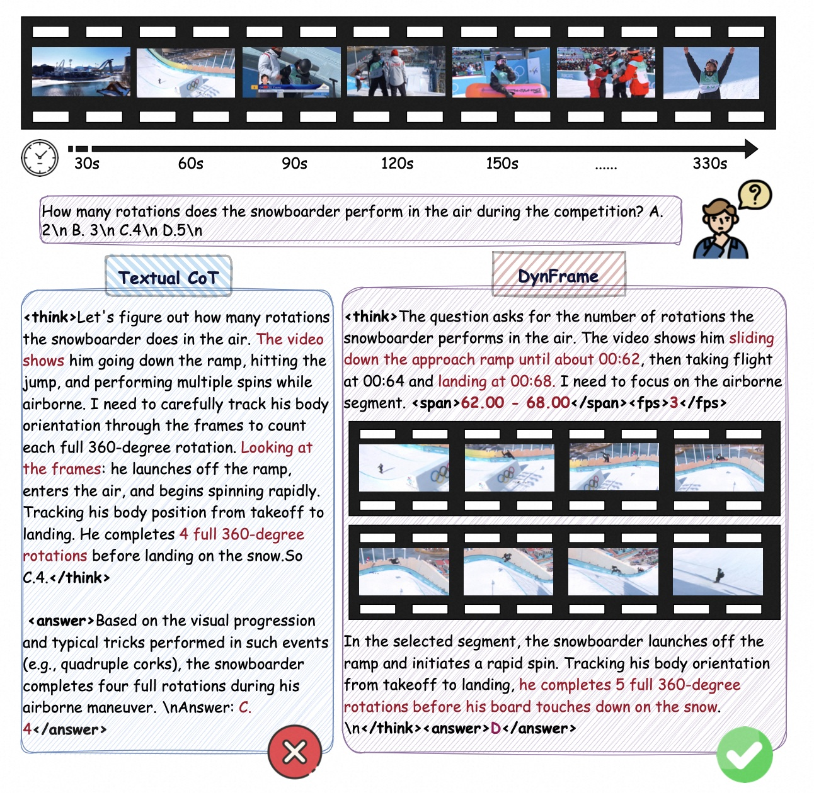
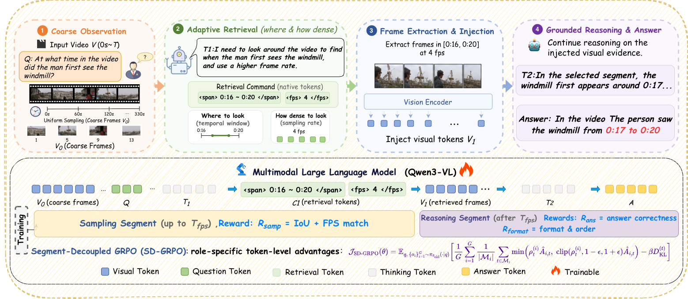
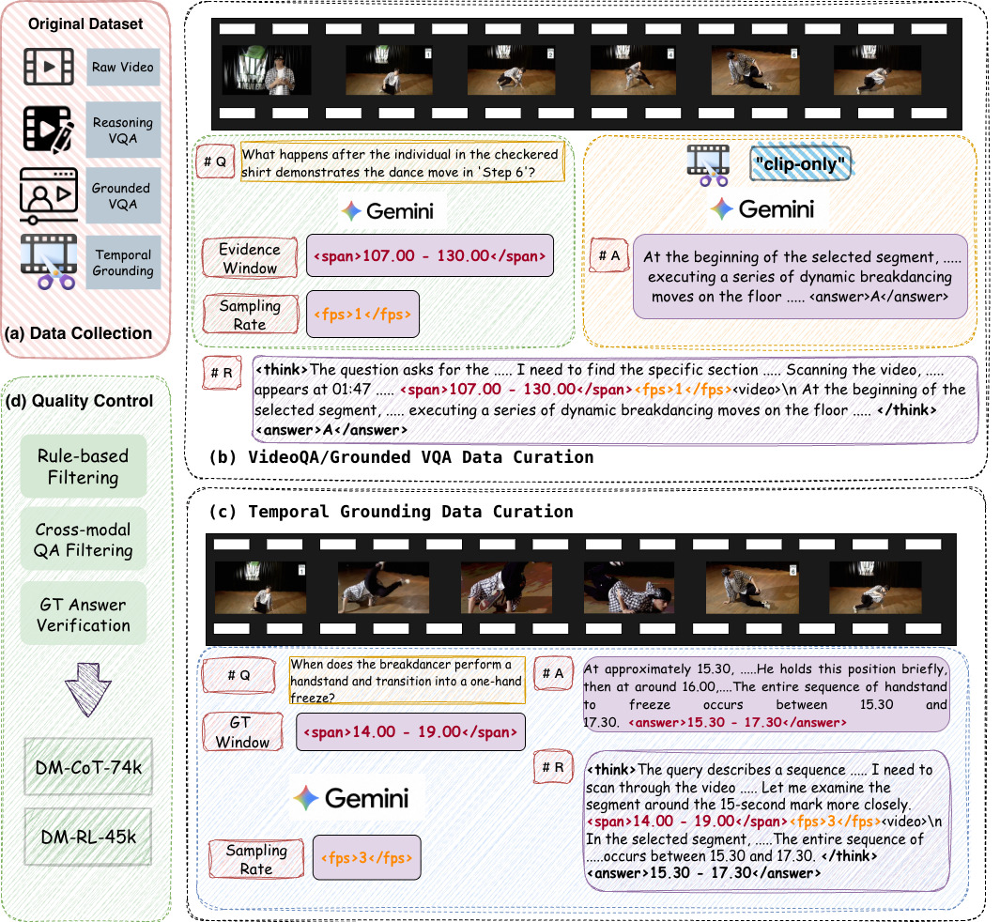

<h1 align="center">DynFrame: Adaptive Reasoning-Driven Multimodal Framework with Dynamic Frame Augmentation for Complex Video Understanding</h1>

<p align="center">
  <a href="https://arxiv.org/abs/2605.26680"></a>
  <a href="https://huggingface.co/datasets/pangzihao/DynFrame_Dataset"></a>
  <a href="#"></a>
</p>

> **DynFrame** is an end-to-end framework that unifies adaptive reasoning with dynamic frame retrieval within a single autoregressive pass. Unlike prior tool-augmented pipelines, DynFrame emits the temporal window and sampling density as native tokens, turning frame-rate adaptation into a learnable per-step decision that acquires multi-granularity evidence with a single retrieval step.

Traditional Textual CoT (left) reasons over a fixed sparse frame set and misses critical visual evidence. DynFrame (right) emits `<span>` and `<fps>` tokens within its reasoning to retrieve a denser, temporally focused frame set, then continues reasoning over the augmented visual context.

<p align="center">
  
</p>

## 🔥 Highlights

- **Learnable Span–Density Retrieval**: The model emits `<span>` and `<fps>` tokens during reasoning to specify *which temporal window* and *at what sampling density* to retrieve additional frames — turning frame-rate adaptation from a system hyperparameter into a learnable per-step decision.
- **Dynamic Frame Injection**: Retrieved frames are encoded and injected into the decoding context on-the-fly, enabling tight grounding between intermediate reasoning and visual evidence.
- **Segment-Decoupled GRPO (SD-GRPO)**: A novel RL algorithm that splits each rollout at the retrieval boundary and assigns role-specific token-level advantages — separately crediting the sampling decision and the answer reasoning for more targeted policy optimization.
- **Two Dedicated Datasets**: **DM-CoT-74k** for supervised fine-tuning and **DM-RL-45k** for reinforcement learning, covering temporal grounding, VideoQA, and grounded VideoQA tasks.
- **State-of-the-Art**: DynFrame-4B matches or surpasses 7B–8B counterparts across six benchmarks; DynFrame-8B sets new state-of-the-art on most metrics.

## 🏗️ Architecture

DynFrame operates in a three-stage reasoning process within a single autoregressive pass: **coarse reasoning → adaptive retrieval → grounded reasoning**. The framework interleaves tokenized temporal retrieval with dynamic frame injection to adaptively gather visual evidence, enhanced by Segment-Decoupled GRPO for targeted policy optimization.

<p align="center">
  
</p>

The complete trajectory: **s = {V₀, T₁, C₁, V₁, T₂, A}**

Built upon Qwen3-VL-Thinking, DynFrame introduces three key designs: (i) a tokenized retrieval interface that expresses temporal span and sampling density as generation tokens, (ii) dynamic frame injection that encodes and inserts retrieved frames into the decoding context, and (iii) SD-GRPO that exploits the explicit retrieval boundary for segment-specific credit assignment.

### Tokenized Retrieval Interface

The model emits special tokens to express frame retrieval as part of its autoregressive generation:

- `<span>tₛ - tₑ</span>` — specifies the temporal window to retrieve
- `<fps>f</fps>` — specifies the sampling frame rate

The number of retrieved frames is computed as: **N = ⌊(tₑ - tₛ) × f⌋**

### Segment-Decoupled GRPO (SD-GRPO)

SD-GRPO partitions each completion at the `</fps>` token into:

- **Sampling segment** (tokens before injection): optimized with sampling reward (IoU + FPS match)
- **Reasoning segment** (tokens after injection): optimized with answer reward + format reward

This decoupled design resolves credit-assignment imbalance in standard GRPO, where a wrong answer would incorrectly penalize good retrieval decisions, and vice versa.

## 🚀 Getting Started

### Installation

```bash
git clone https://github.com/zhangguanghao523/DynFrame.git
cd DynFrame
pip install -r requirements.txt
```

**Key dependencies:** `transformers==4.57.0`, `trl==0.28.0`, `deepspeed==0.16.2`, `accelerate==1.7.0`, `peft==0.14.0`

### Training

#### Stage 1: Cold-Start SFT

Train on DM-CoT-74k to establish interleaved retrieval and reasoning behaviors:

```bash
bash scripts/train/DynFrame_sft.sh
```

#### Stage 2: Reinforcement Learning with SD-GRPO

Further optimize with segment-decoupled rewards on DM-RL-45k:

```bash
bash scripts/train/DynFrame_grpo.sh
```

### Inference

```bash
bash scripts/eval/inference.sh
```

## 📦 Datasets

📥 **Download:** [🤗 HuggingFace — DynFrame_Dataset](https://huggingface.co/datasets/pangzihao/DynFrame_Dataset)

### DM-CoT-74k (SFT)

74k samples with interleaved reasoning trajectories, including explicit `<span>`/`<fps>` retrieval commands and grounded reasoning. Format: ShareGPT.

<details>
<summary><b>Example</b></summary>

```
Human: <video>
Give you a textual query: A young woman is seen standing in a room and leads into her dancing.
When does the described content occur in the video?
Please return the timestamp in seconds.

A: <think>Let me break down the sentence... I need to find the period
where the woman is first just standing, and then the transition as she begins
to dance. <span>0.83 - 19.86</span><fps>2</fps><video>
 Looking at the images:
- At 0.00s to about 4.83s, she is standing still...
- At 6.89s, her arms are up and she is clearly starting to dance...
</think><answer>0.83 - 19.86</answer>
```

</details>

### DM-RL-45k (RL)

45k question-video pairs with ground-truth temporal spans, FPS targets, and answers for reward computation. Format: Alpaca.

<details>
<summary><b>Example</b></summary>

```json
{
  "prompt": "<video>\nGive you a textual query: a person opens a laptop\nWhen does the described content occur in the video?\nPlease return the timestamp in seconds.",
  "video": "data/videos/charades_sta/MLBTH.mp4",
  "answer": "0.00 - 8.00",
  "fps": 3,
  "gt_span_start": 0.0,
  "gt_span_end": 8.0
}
```

</details>

### Data Curation Pipeline

The data curation pipeline covers data collection from existing benchmarks, evidence window & FPS annotation via Gemini-2.5-Pro, and multi-stage quality control (rule-based filtering, cross-modal QA filtering, GT answer verification).

<p align="center">
  
</p>

 Temporal evidence and FPS annotations are generated using Gemini-2.5-Pro with a two-stage prompting pipeline (see paper §3.3 for details).

## 📝 Citation

If you find this work useful, please cite:

```bibtex
@article{zhang2026dynframe,
  title={DynFrame: Adaptive Reasoning-Driven Multimodal Framework with Dynamic Frame Augmentation for Complex Video Understanding},
  author={Zhang, Peng and Zhang, Guanghao and He, Wanggui and Zhang, Longxiang and Liu, Mushui and Xia, Yan and Peng, Zhenhao and Dai, Weilong and Liu, Jinlong and Tang, Haobing and Zhang, Le and Jiang, Hao and Huang, Pipei},
  journal={arXiv preprint arXiv:2605.26680},
  year={2026}
}
```

## 🙏 Acknowledgements

This codebase is built upon [LLaMA-Factory](https://github.com/hiyouga/LLaMA-Factory) and [Qwen3-VL](https://github.com/QwenLM/Qwen3-VL). We thank the authors for their excellent work.

## 📄 License

This project is released under the [Apache 2.0 License](LICENSE).
